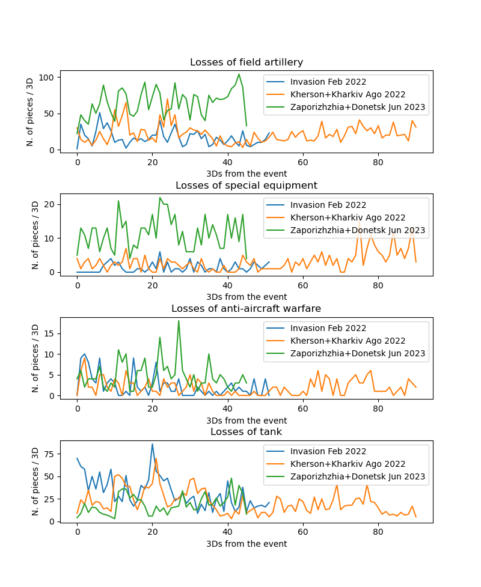

# ukr invasion

To plot a resampling on multiple events (i.e. dates) of the Russian losses per type of loss and units of time.

Data available here: https://github.com/PetroIvaniuk/2022-Ukraine-Russia-War-Dataset

Either in a terminal:
```
python ru_losses.py
```

Or in a python interpreter:
```
import ru_losses

file = "https://raw.githubusercontent.com/PetroIvaniuk/2022-Ukraine-Russia-War-Dataset/main/data/russia_losses_equipment.json"
corrige = ""

loss = ru_losses.RULosses(file_path=file, corrige_path=corrige, autoload=True)

loss.inspect()
loss.resample(period='3D')

loss.cond_plot(
               columns=["field artillery","special equipment","anti-aircraft warfare","tank"],
               events=['2022-02-24','2022-08-01','2023-05-01'],
               legend=['Invasion Feb 2022', 'Kherson+Kharkiv Ago 2022', 'Zaporizhzhia+Donetsk Jun 2023'],
               figsize=(8,12), ls='-'
              )
```



